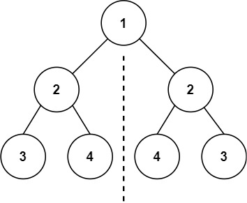

给你一个二叉树的根节点 root ， 检查它是否轴对称。


示例 1：


> 输入：root = [1,2,2,3,4,4,3]
> 
> 输出：true
> 
> 

示例 2：


> 输入：root = [1,2,2,null,3,null,3]
> 输出：false
> 

## 解法
递归判断
```java
/**
 * Definition for a binary tree node.
 * public class TreeNode {
 *     int val;
 *     TreeNode left;
 *     TreeNode right;
 *     TreeNode() {}
 *     TreeNode(int val) { this.val = val; }
 *     TreeNode(int val, TreeNode left, TreeNode right) {
 *         this.val = val;
 *         this.left = left;
 *         this.right = right;
 *     }
 * }
 */
class Solution {
    public boolean isSymmetric(TreeNode root) {
        if(root == null){
            return true;
        }
        if(root.right == null && root.left == null){
            return true;
        }
        if(root.left != null && root.right != null){
            return judge(root.left, root.right);
        }
        return false;
    }

    public boolean judge(TreeNode left, TreeNode right){
        if(left == null && right == null){
            return true;
        }
        if(left != null && right != null){
            if(left.val == right.val){
                return judge(left.left, right.right) && judge(left.right, right.left);
            }
        }
        return false;
    }
}
```