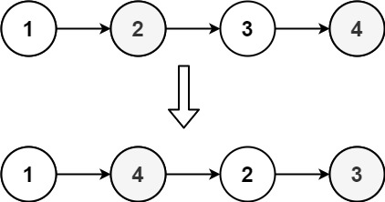

给定一个单链表 L 的头节点 head ，单链表 L 表示为：

L0 → L1 → … → Ln - 1 → Ln

请将其重新排列后变为：

L0 → Ln → L1 → Ln - 1 → L2 → Ln - 2 → …

不能只是单纯的改变节点内部的值，而是需要实际的进行节点交换。



输入：head = [1,2,3,4]

输出：[1,4,2,3]


输入：head = [1,2,3,4,5]

输出：[1,5,2,4,3]

## 解法
1. 快慢链表找到中点
2. 开断 变成两个链表
3. 反转链表
4. 两个链表生成一个
```java
/**
 * Definition for singly-linked list.
 * public class ListNode {
 *     int val;
 *     ListNode next;
 *     ListNode() {}
 *     ListNode(int val) { this.val = val; }
 *     ListNode(int val, ListNode next) { this.val = val; this.next = next; }
 * }
 */
class Solution {
    public void reorderList(ListNode head) {
        if(head == null || head.next == null){
            return;
        }
        ListNode slow = head;
        ListNode fast = head;
        // find mid
        while(fast.next != null && fast.next.next != null){
            slow = slow.next;
            fast = fast.next.next;
        }

        ListNode newHead = slow.next;
        slow.next = null;
        // reverse right part
        newHead = reverseList(newHead);

        // merge 2 list
        while(newHead !=null){
            ListNode tmp = newHead.next;
            newHead.next = head.next;
            head.next = newHead;
            head = newHead.next;
            newHead = tmp;
        }

    }

    public ListNode reverseList(ListNode head){
        ListNode curr = head;
        ListNode pre = null;
        while(curr!=null){
            ListNode next = curr.next;
            curr.next = pre;
            pre = curr;
            curr = next;
        }
        return pre;
    }
}
```