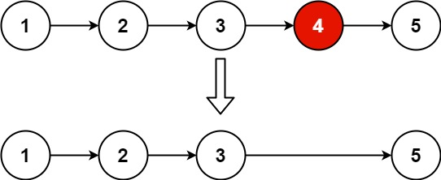

给你一个链表，删除链表的倒数第 n 个结点，并且返回链表的头结点。


示例 1：


输入：head = [1,2,3,4,5], n = 2
输出：[1,2,3,5]
示例 2：

输入：head = [1], n = 1
输出：[]
示例 3：

输入：head = [1,2], n = 1
输出：[1]


提示：

链表中结点的数目为 sz
1 <= sz <= 30
0 <= Node.val <= 100
1 <= n <= sz


进阶：你能尝试使用一趟扫描实现吗？

## 解法
双指针，注意如果是删除第一个节点（倒数最后一个），直接返回head.next即可
```java
/**
 * Definition for singly-linked list.
 * public class ListNode {
 *     int val;
 *     ListNode next;
 *     ListNode() {}
 *     ListNode(int val) { this.val = val; }
 *     ListNode(int val, ListNode next) { this.val = val; this.next = next; }
 * }
 */
class Solution {
    public ListNode removeNthFromEnd(ListNode head, int n) {
        if(head == null || head.next == null){
            return null;
        }
        ListNode first = head;
        ListNode second = head;
        while(n>0){
            first = first.next;
            n--;
        }
        if(first == null){
            return head.next;
        }
        while(first.next!=null){
            first = first.next;
            second = second.next;
        }
        second.next = second.next.next;
        return head;
    }
}
```