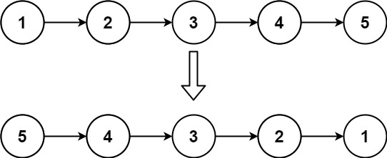

给你单链表的头节点 head ，请你反转链表，并返回反转后的链表。


示例 1：



输入：head = [1,2,3,4,5]
输出：[5,4,3,2,1]

示例 2：


输入：head = [1,2]
输出：[2,1]
示例 3：

输入：head = []
输出：[]


提示：

链表中节点的数目范围是 [0, 5000]
-5000 <= Node.val <= 5000


进阶：链表可以选用迭代或递归方式完成反转。你能否用两种方法解决这道题？

## 解法
递归
```java
/**
 * Definition for singly-linked list.
 * public class ListNode {
 *     int val;
 *     ListNode next;
 *     ListNode() {}
 *     ListNode(int val) { this.val = val; }
 *     ListNode(int val, ListNode next) { this.val = val; this.next = next; }
 * }
 */
class Solution {
    public ListNode reverseList(ListNode head) {
        //递归的方式
        if(head == null || head.next == null)
            return head;

        ListNode newhead = reverseList(head.next);
        head.next.next = head;
        head.next = null;
        return newhead;
    }
}
```
栈
```java
/**
 * Definition for singly-linked list.
 * public class ListNode {
 *     int val;
 *     ListNode next;
 *     ListNode() {}
 *     ListNode(int val) { this.val = val; }
 *     ListNode(int val, ListNode next) { this.val = val; this.next = next; }
 * }
 */
class Solution {
    public ListNode reverseList(ListNode head) {
        if(head == null){
            return null;
        }
        Stack<Integer> s = new Stack<Integer>();
        ListNode node = head;
        while(node != null){
            s.push(node.val);
            node = node.next;
        }
        ListNode res = new ListNode();
        ListNode ans = res;
        while(!s.isEmpty()){
            ListNode tmp = new ListNode();
            tmp.val = s.pop();
            res.next = tmp;
            res = res.next;
        }
        return ans.next;
    }
}
```