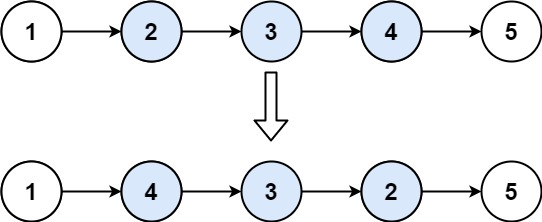

给你单链表的头指针 head 和两个整数 left 和 right ，其中 left <= right 。请你反转从位置 left 到位置 right 的链表节点，返回 反转后的链表 。


示例 1：


输入：head = [1,2,3,4,5], left = 2, right = 4
输出：[1,4,3,2,5]

示例 2：

输入：head = [5], left = 1, right = 1
输出：[5]


提示：
- 链表中节点数目为 n
- 1 <= n <= 500
- -500 <= Node.val <= 500
- 1 <= left <= right <= n


进阶： 你可以使用一趟扫描完成反转吗？

## 解法
先切割出要反转的部分，再接回
```java
/**
 * Definition for singly-linked list.
 * public class ListNode {
 * int val;
 * ListNode next;
 * ListNode() {}
 * ListNode(int val) { this.val = val; }
 * ListNode(int val, ListNode next) { this.val = val; this.next = next; }
 * }
 */
class Solution {
    public ListNode reverseBetween(ListNode head, int left, int right) {
        ListNode res = new ListNode(-1);
        res.next = head;

        ListNode beforeLeft = res;
        for (int i = 0; i < left - 1; i++) {
            beforeLeft = beforeLeft.next;
        }

        ListNode rightNode = beforeLeft;
        for (int i = 0; i < right - left + 1; i++) {
            rightNode = rightNode.next;
        }
        // 关键 这里切割出一个子链表
        ListNode leftNode = beforeLeft.next;
        ListNode curr = rightNode.next;
        // 开始断
        beforeLeft.next = null;
        rightNode.next = null;
        // 反转
        reverse(leftNode);
        // 接回
        beforeLeft.next = rightNode;
        leftNode.next = curr;
        return res.next;
    }

    public void reverse(ListNode left) {
        ListNode pre = null;
        ListNode cur = left;
        while (cur != null) {
            ListNode next = cur.next;
            cur.next = pre;
            pre = cur;
            cur = next;
        }
    }
}
```